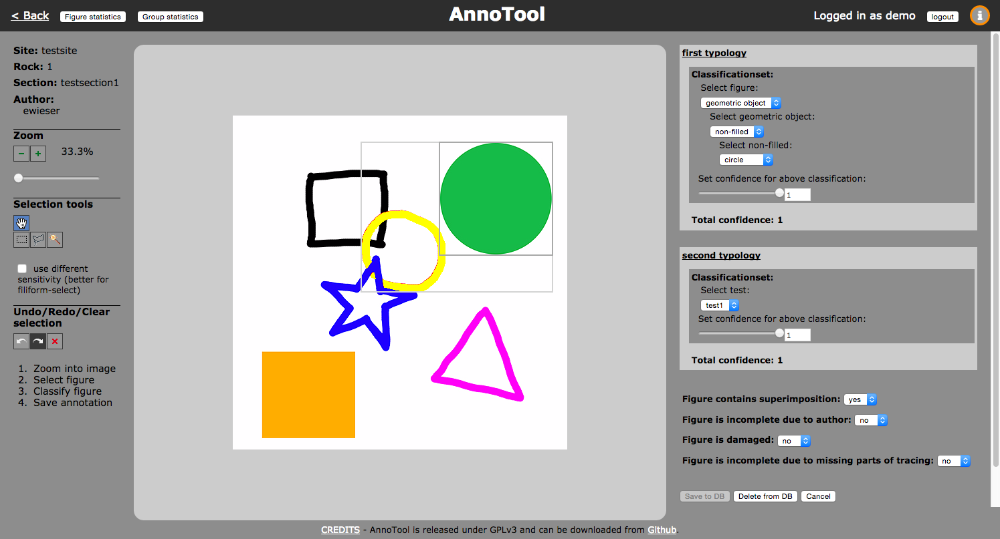
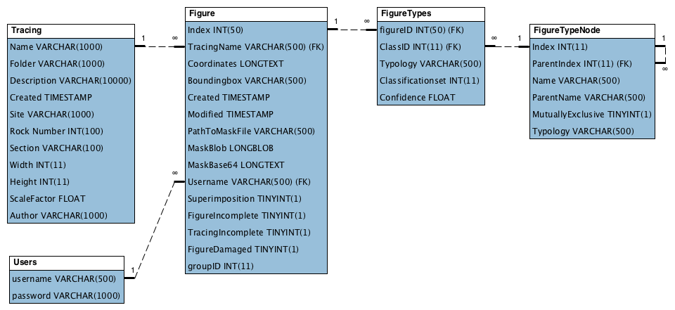
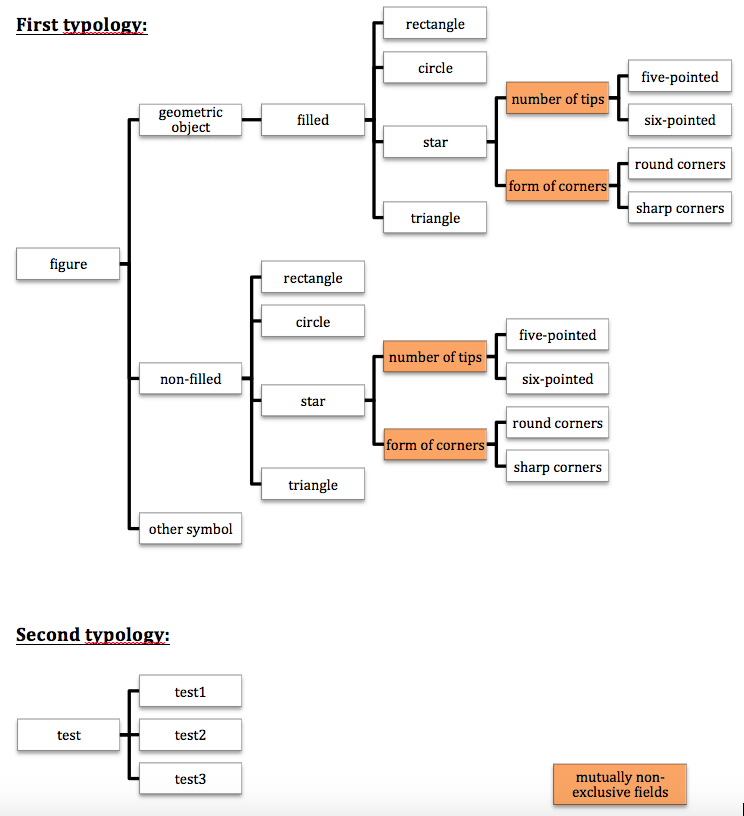

AnnoTool
========

a Multiuser Annotation Webtool for large 2D graphics

Figures can be selected utilizing several state-of-the-art selection tools, and annotated with class labels from multiple typologies.

If you use the AnnoTool and if appropriate, please cite the following article in which the tool is explained in detail:

Seidl M., Wieser E., Alexander C., 2015, Automated classification of petroglyphs, *Digital Applications in Archaeology and Cultural Heritage* 3, 2015, pp.196-212.
<http://dx.doi.org/10.1016/j.daach.2015.03.001>

The development of AnnoTool has received funding from the EC FP7 project [3D-PITOTI](http://3d-pitoti.eu) (ICT-2011-600545).

Requirements
------------

A webserver with:
* Apache
* PHP
* MySQL

For local development you can use [XAMPP](https://www.apachefriends.org/de/index.html).

AnnoTool was tested with [Google Chrome Browser](https://www.google.de/chrome/browser/desktop/), although it should work with all HTML5 capable web browsers. On Safari some troubles were reported, due to a built-in default timeout for synchronous AJAX-requests.

Installation
------------

* Copy all files on your webserver.
* Import example database [*annotool.sql*](#exampledatabase) into your MySQL-DB
* Change the database credentials in *config.inc.php*
* Open *.../index.php* in your webbrowser
* Log in as *admin*
* Change passwords of all standard users!!!

Description
-----------

This is a coarse description of the AnnoTool and its components. For more information about the usage of the tools and the annotation process, please open the infobox included in the AnnoTool by clicking the (i)-button in the upper right corner.

### Tracings
To enable fast zooming and panning of large images in the web browser, they need to be tiled
and stored at several zoom levels. For AnnoTool, we use the *Zoomify* file/folder-structure.
Adobe Photoshop provides the export it in this format (*File - Export - Zoomify*).

The folder stack of each tracing needs to be in a separate folder in *./tracings*. The path to the folder for each tracing, along with some other information, needs to be manually entered into the table [*Tracing*](#tracingtable) in the database.

You may rescale the original image prior to tiling and uploading. The size of a single figures on it should not exceed the size of the screen. Otherwise the selection of a whole figure has to be done by concatenating multiple selections.

### Figure selection
The selection of a figure is only enabled at the maximum zoom level. You can use the scrollwheel,
or the UI in the left sidebar for zooming in and out.
AnnoTool was developed to work with pre-processed tracings, where white area is considered as background.
So only non-white pixels can be selected with the figure selection tools.
The pixel selection algorithm works on the RGB-values, the best results are achieved with high-contrast and b/w images.
Multiple figures can be grouped, but for a group no additional annotation is possible by now.

The mask of a figure is stored as 1-bit bitmap in the *./figures* folder with a unique hash as filename. This filename, along with some other parameters of the selection (bounding box, timestamp, ...) are stored in the table [*Figure*](#figuretable) in the database.

For more information about the figure selection tools, please open the infobox by clicking the (i)-button in the upper right corner in the AnnoTool.

### Annotation
Selected figures can be annotated with multiple typologies, which are loaded dynamically from the database, 
and several fixed flags, which are hardcoded by now (figure superimposed, figure incomplete, tracing incomplete, figure damaged).
For unsure classifications multiple classificationsets are allowed per typology.

The annotated classes for the selected figure are stored in the table [*FigureTypes*](#figuretypestable) in the database.

For more information about the annotation process, please open the infobox by clicking the (i)-button in the upper right corner in the AnnoTool.

### Typology
The typologies are stored in the database in the table [*FigureTypeNode*](#figuretypenodetable) in a tree structure. 

### Users
AnnoTool provides several user roles to allow for independent annotation of multiple experts, which can be supervised by an admin-user.
The roles for admin, ReadOnly and demo-user are hardcoded, so make sure to keep the usernames as they are.
Passwords are stored encrypted in the table [*Users*](#userstable) in the database.

###### Admin-user
* Sees all annotations (except demo’s)
* Can make new ones
* Register new users

###### ReadOnly-user
* Sees all annotations (except demo’s)
* is not allowed to change existing annotations or make new ones

###### Demo-user
* Sees only his annotations
* Can make new ones, which are not seen by any other users

###### Other users
* Can make new annotations
* See only their own annotations

### Statistics
AnnoTool provides a simple listing for the number of annotated figures and groups (buttons *Figure statistics* and *Group statistics* in the header). By clicking on a number you get the thumbnails of all figures of the selected class.

Description of DB-tables
------------------------

### Tracing table
The Name-field is used as index and has to be unique for each tracing.
The Folder-field contains the path to the folder with the tiles.
The Site-, Rock number-, and Section-fields are used for the hierarchy on the tracings-listing page.
Width and Height contain the full size in pixels of the rescaled image, the tiles were generated from.
The ScaleFactor-field can be used for later reference to the original image size.
The Author-field is only used for credits.

### FigureTypeNode table
The hierarchy is given by the Index/ParentIndex-fields.
The mutually-exclusive flag indicates options that don't exclude each other.

### Figure table
For each figure selection an entry in this table is created with a timestamp, the fixed flags of the annotation, the path to the image mask, and the references to the tracing this figure is on and the user that made the selection.

### FigureTypes table
For one annotation of a figure, an entry is created for each selected class, with the confidence value and reference to the figure and the class. Thus the whole annotation tree for each figure is represented in this table.

### Users table
Contains the usernames and encrypted passwords of all users.

###### Admin-user

 * **Username:**	admin
 * **Standard-Password:**	admin

###### ReadOnly-user

 * **Username:**	ReadOnly
 * **Standard-Password:**	ReadOnly

###### Demo-user

 * **Username:**	demo
 * **Standard-Password:**	demo

**!!! IMPORTANT NOTICE: CHANGE STANDARD PASSWORDS OF ALL USERS TO PREVENT UNAUTHORIZED ACCESS !!!**

Example database file
---------------------
The example database file **_annotool.sql_** contains:

 * 3 standard users (admin, demo, ReadOnly)
 * 1 testimage
 * 2 dummy typologies
 * several test annotations by different users

CREDITS
-------

AnnoTool was developed in the 3D-PITOTI project (<http://www.3d-pitoti.eu>) for the annotation of large tracings of prehistoric rock art figures. The development of AnnoTool has received funding from the EC FP7 project [3D-PITOTI](http://3d-pitoti.eu) (ICT-2011-600545).
It is based on [Mozilla miniPaint](https://developer.mozilla.org/en-US/demos/detail/minipaint), and [CanvasZoom](http://www.akademy.co.uk/software/canvaszoom/canvaszoom.php).

Libraries used:
* [CryptoJS](https://code.google.com/p/crypto-js/)
* [jQuery](https://jquery.coms)
* [bitmap.js](http://mrcoles.com/blog/making-images-byte-by-byte-javascript/)

(C) 2012-2015 Media Computing Research Group (<http://mc.fhstp.ac.at>)
Institute for Creative \Media/ Technologies (IC\M/T)
St. Poelten, University of Applied Sciences (FHSTP) (<http://www.fhstp.ac.at>)

Developed by: 	
* Ewald Wieser
* Markus Seidl
* Matthias Zeppelzauer

Released under GPL v3 (see [LICENSE.txt](LICENSE.txt)).

CITATION
--------

If you use the AnnoTool and if appropriate, please cite the following article in which the tool is explained in detail:

Seidl M., Wieser E., Alexander C., 2015, Automated classification of petroglyphs, *Digital Applications in Archaeology and Cultural Heritage* 3, 2015, pp.196-212.
<http://dx.doi.org/10.1016/j.daach.2015.03.001>

    @article{ Seidl2015196,
    	author = "Markus Seidl and Ewald Wieser and Craig Alexander"
        title = "Automated classification of petroglyphs ",
        journal = "Digital Applications in Archaeology and Cultural Heritage ",
        volume = "2",
        number = "2–3",
        pages = "196 - 212",
        year = "2015",
        doi = "http://dx.doi.org/10.1016/j.daach.2015.03.001",
        url = "http://www.sciencedirect.com/science/article/pii/S2212054815000090",
    }
